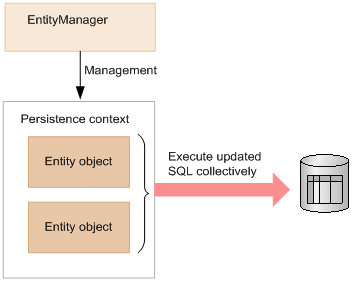

# Hibernate knowledge
## Core
### Architecture

<details>
  <summary>Overview</summary>
  <br/>
  
  
  
</details>

<details>
  <summary>JPA vs ORM</summary>
  <br/>
  
  **ORM:** Object Relational Mapping is concept/process of converting the data from Object oriented language to relational DB and vice versa.
  
  **JPA:** The Java Persistence API is a Java specification. JPA is now considered the standard approach for Object to Relational Mapping (ORM).
  
</details>

<details>
  <summary>JPA and Hibernate</summary>
  <br/>
  
  
  
  JPA architecture | Hibernate architecture | 
  --- | --- |
  EntityManagerFactory | SessionFactory |
  EntityTransaction | Transaction |
  EntityManager | Session |

</details>

### Advantages and disadvantages (vs JBDC)

<details>
  <summary>Advantages</summary>
  <br/>
  
  + Hibernate supports to build relationships based on the data model.
  + Hibernate supports lot of databases.
  + Hibernate maintains database connection pool.
  + Hibernate has Caching mechanism. Using this number of database hits will be reduced
  + Hibernate generates the SQL on the fly and then automatically executes the necessary SQL statements. 
  
</details>

<details>
  <summary>Disadvantages</summary>
  <br/>
  
  + Lots of API to learn
  + Slower than JDBC
  + Generates complex quires with many joins
  + Not suitable for small project
  
</details>

### Persistence Context

A persistence context is a set of entity instances. Within the persistence context, the entity instances and their lifecycle are managed.

<details>
  <summary>Persistence Context Type</summary>
  <br/>
    
  Persistence contexts are available in two types:

  + Transaction-scoped persistence context (default)
  + Extended-scoped persistence context

</details>

<details>
  <summary>Persistent Context and Session/Entity Manager</summary>
  <br/>
  
  + **Persistent Context** is a run time memory area where Hibernate holds the references of objects (entities). At runtime whenever a session is opened and closed, between those open and close boundaries Hibernate maintains the object in a **Persistence Context**.
  + **Session/EntityManager** provides API to interact with the **enities**. Some APIs are provided by **Session**: _(session -> entities)_
    + Basic CRUD operation
    + Query Execution
    + Control of Transaction
    + Management of Persistent Context
    
    
  
  Ref: https://tech.lalitbhatt.net/2014/07/hibernate-persistent-context-and-session.html
  
</details>

### Entity lifecycle

<details>
  <summary>Overview</summary>
  <br/>
  
  
  
  State | Description | 
  --- | --- |
  New or Transient | Transient entities exist in heap memory as normal Java objects. The persistent context does not track the changes done on them. It don't associcate with any **Session** and not mapped to any database table row.|
  Persistent or Managed | A persistent entity is mapped to a specific database row. Hibernate’s current running **Session** is responsible for tracking all changes. |
  Detached | Detached entities have a representation in the database but these are currently not associcate with any **Session**. |
  Removed | Removed entities are entities that already exist in the database and will be deleted after flushing (commit) |
  
  Ref: https://howtodoinjava.com/hibernate/hibernate-entity-persistence-lifecycle-states/
  
</details>

### Automatic dirty checking
<details>
  <summary>Explain</summary>
  <br/>
  
  For managed entities, Hibernate can auto-detect incoming changes and schedule SQL UPDATES. This mechanism is called automatic dirty checking.
  
  
  _At flush time (commit)_
  
  Ref: https://www.codementor.io/@narendrasharma95ns/life-cycle-of-an-entity-object-dirty-checking-in-hibernate-lvh1dh5jz
  
</details>

<details>
  <summary>Write-Behind Technique</summary>
  <br/>
  
  Ref: http://learningviacode.blogspot.com/2012/02/write-behind-technique-in-hibernate.html
  
</details>

### Inheritance

Inheritance is one of the most important of object-oriented principles. But the relational databases do not support inheritance. Hibernate’s Inheritance Mapping strategies deal with this issue.

<details>
  <summary>Types of inheritance strategy</summary>
  <br/>
  
  + MappedSuperclass – the parent classes, can't be entities
  + Single Table – The entities from different classes are placed in a single table.
  + Joined Table – Each class has its table, and querying a subclass entity requires joining the tables.
  + Table per Class – All the properties of a class are in its table, so no join is required.
  
  Ref: https://www.baeldung.com/hibernate-inheritance
  
</details>
<details>
  <summary>MappedSuperclass</summary>
  <br/>
  
  
  
</details>
<details>
  <summary>Single Table</summary>
  <br/>
  
  
  
</details>
<details>
  <summary>Joined Table</summary>
  <br/>
  
  
  
</details>
<details>
  <summary>Table per Class</summary>
  <br/>
  
  
  
</details>
<details>
  <summary>Can Entity be an abstract class?</summary>
  <br/>
  
  Perhaps, at the same time, it retains all the properties of the Entity, except that it cannot be directly initialized.
  
</details>
<details>
  <summary>@DiscriminatorValue annotation in Hibernate</summary>
  <br/>
  
  Discriminator is commonly used in `SINGLE_TABLE` inheritance. You need a column to identify the type of the record.
  
  _Example:_ You have a class `Student` and 2 sub-classes: `GoodStudent` and `BadStudent`. Both Good and BadStudent data will be stored in 1 table, but of course we need to know the type and that's when (`DiscriminatorColumn` and) `DiscriminatorValue` will come in.
  
  ```
  @Entity
  @Table(name ="Student")
  @Inheritance(strategy=SINGLE_TABLE)
  @DiscriminatorColumn(discriminatorType = DiscriminatorType.STRING,
      name = "Student_Type")
  public class Student{
       private int id;
       private String name;
  }
  ```
  _Student class_
  
  ```
  @Entity
  @DiscriminatorValue("Bad Student")
  public class BadStudent extends Student{ 
   //code here
  }
  ```
  _Bad Student class_
  
  ```
  @Entity
  @DiscriminatorValue("Good Student")
  public class GoodStudent extends Student{ 
  //code here
  }
  ```
  _Good Student class_
  
  id|Student_Type | Name |
  --|-------------|-------|
  1 |Good Student | Ravi |
  2 |Bad Student  | Sham |
  
  _Result_
  
</details>

### Identifiers

<details>
  <summary>Identify type</summary>
  <br/>
  
  + **Auto:** Let Hibernate pick one of the following strategies.
  + **Identity:** Use an autoincremented database columns.
  + **Sequence:** Use a database sequence.
  + **Table:** Use a database table to simulate a sequence (The table will be stored ids).
  
  Ref: https://thorben-janssen.com/primary-key-mappings-jpa-hibernate/
</details>
<details>
  <summary>Identity vs Sequence</summary>
  <br/>
  
  + **Identity:**
  
  Hibernate will create a sequence and use for primary column is default value.
  ```
  CREATE TABLE public.session
  (
      id bigint NOT NULL DEFAULT nextval('session_id_seq'::regclass),
      ..
  )
  ```
  The next value of the sequence will be called automatically when the record is inserted into the database.
  + **Sequence:**
  
  ```
  select
    nextval ('data_sequence')
  -----------------------------
  insert 
  into
      data
      (data1, data2, data3, data4, data_id) 
  values
      (?, ?, ?, ?, ?)
  ```
  
  Hibernate will create a sequence and select the next value of the sequence before inserting the record into the database.
  
  Note: Only true with **Postgres** database.
  
</details>
<details>
  <summary>Graps of the Primary key when rollback the transactions</summary>
  <br/>
  
  + Ref: https://stackoverflow.com/questions/449346/mysql-auto-increment-does-not-rollback
  + Ref: https://stackoverflow.com/questions/22787153/gaps-in-the-sequence-values-generated-by-jpa-generatedvalue-with-postgresql
  + Ref: https://stackoverflow.com/questions/20636144/are-jpa-and-hibernate-entity-identifiers-reset-to-null-after-a-rollback/67401366#67401366
</details>
<details>
  <summary>Why does Hibernate disable INSERT batching when using an IDENTITY?</summary>
  <br/>
  
  + Ref: https://stackoverflow.com/questions/27697810/why-does-hibernate-disable-insert-batching-when-using-an-identity-identifier-gen
</details>
<details>
  <summary>Sequence identifier strategies</summary>
  <br/>
  
  + Ref: https://vladmihalcea.com/hibernate-hidden-gem-the-pooled-lo-optimizer/
  + Ref: https://vladmihalcea.com/the-hilo-algorithm/
</details>


### Map Associations

<details>
  <summary>Types of associations</summary>
  <br/>
  
  + OneToOne
  + OneToMany
  + ManyToOne
  + ManyToMany
  
  
  
</details>
<details>
  <summary>OneToOne</summary>
  <br/>
  
  PK and FK columns are most often indexed, so sharing the PK can reduce the index footprint by half, which is desirable since you want to store all your indexes into memory to speed up index scanning. And EAGER fetching is bad.
  
  The best way to map a `@OneToOne` relationship is to use `@MapsId`. (use the `@JoinColumn` to customize the key name)
  
  While the unidirectional `@OneToOne` association can be fetched lazily, the parent-side of a bidirectional `@OneToOne` association is not.
  
  ```
  @Entity(name = "management")
  public class ManagementEntity implements Serializable {

      private static final long serialVersionUID = -495703064152328044L;

      @OneToOne(fetch = FetchType.LAZY, orphanRemoval = true)
      @JoinColumn(name = "data_id")
      @MapsId
      private DataEntity dataEntity;

      @Id
      @Column(name = "management_id")
      private Long managementId; // You’ll notice that the @Id column no longer uses a @GeneratedValue annotation since the identifier is populated with the identifier of the DataEntity association.
      
      ...
  }
  ```
  
  Ref: https://vladmihalcea.com/the-best-way-to-map-a-onetoone-relationship-with-jpa-and-hibernate/
</details>
<details>
  <summary>OneToMany & ManyToOne</summary>
  <br/>
  
  `@ManyToOne` might be just enough. It does not mean this should be the default option for every one-to-many database relationship.
  
  In reality, `@OneToMany` is practical only when many means few.
  
  Note: If not careful, `@ManyToOne` can cause _n+1 select issue_
  
  + Ref: https://vladmihalcea.com/the-best-way-to-map-a-onetomany-association-with-jpa-and-hibernate/  
  + Ref: https://thorben-janssen.com/best-practices-many-one-one-many-associations-mappings/#Avoid_the_mapping_of_huge_to-many_associations
</details>
<details>
  <summary>ManyToMany</summary>
  <br/>
  
  You should never use a `List` if you model a `Many-to-Many` association. Instead of a `List`, we can use a `Set`.
  
  Avoid the CascadeTypes REMOVE and ALL, which includes REMOVE
  
  ```
  @Entity(name = "post")
  public class Post {
  
      @ManyToMany(cascade = {
          CascadeType.PERSIST,
          CascadeType.MERGE
      })
      @JoinTable(name = "post_tag",
          joinColumns = @JoinColumn(name = "post_id"),
          inverseJoinColumns = @JoinColumn(name = "tag_id")
      )
      private Set<Tag> tags = new TreeSet<>();
      ...
  }
  ```
  
  ```
  @Entity(name = "tag")
  public class Tag {

      @ManyToMany(mappedBy = "tags")
      private Set<Post> posts = new TreeSet<>();
      ...
  }
  ```
  
  + Ref: https://vladmihalcea.com/the-best-way-to-use-the-manytomany-annotation-with-jpa-and-hibernate/
  + Ref: https://thorben-janssen.com/best-practices-for-many-to-many-associations-with-hibernate-and-jpa/
</details>

### Cascade
<details>
  <summary>Cascading best practices</summary>
  <br/>

  1. Cascading only makes sense only for Parent – Child associations (the Parent entity state transition being cascaded to its Child entities). 
  2. Cascading from Child to Parent is not very useful and usually, it’s a mapping code smell.
  3. Use CascadeType.REMOVE and CascadeType.ALL only for to-one associations.
  
  + Ref: https://vladmihalcea.com/a-beginners-guide-to-jpa-and-hibernate-cascade-types/
  + Ref: https://thorben-janssen.com/avoid-cascadetype-delete-many-assocations/#Remove_One_By_One

</details>

### Query
<details>
  <summary>JPQL</summary>
  <br/>
  
  The JPQL (Java Persistence Query Language) is a query language which is used to perform database operations on persistent entities. The role of **JPA** is to transform JPQL into SQL.
  
</details>
<details>
  <summary>Sort</summary>
  <br/>
  
  With Spring Data JPA, you can also add a parameter of type Sort to your method definition
  
  ```
  @Query("FROM Author WHERE firstName = ?1")
  List<Author> findByFirstName(String firstName, Sort sort);
  ```
  
  ```
  Sort sort = new Sort(Direction.ASC, "firstName");
  List<Author> authors = authorRepository.findByFirstName("Thorben", sort);
  ```
  Ref: https://thorben-janssen.com/spring-data-jpa-query-annotation/
</details>
<details>
  <summary>Pagination</summary>
  <br/>
  
  + `LIMIT` clause returns a subset of “n” rows from the query result.
  + `OFFSET` clause placed after the `LIMIT` clause skips "m" number of rows before returning the result query.
  
  ```
  Pageable pageable = PageRequest.of(0, 5, Sort.by("price").descending().and(Sort.by("name")));
  
  Page<Product> allProducts = productRepository.findAll(pageable);
  ```
  
  _Note:_
  1. `offset` in `Pageable` equal `pageIndex * pageSize`
  2. Pagination must use the same order type for all `PageRequest`
  3. When using `JOIN FETCH` with Pagination, it will fetch all associations and make memory increase.
  
  + Ref: https://thorben-janssen.com/pagination-jpa-hibernate/
  + Ref: https://www.baeldung.com/spring-data-jpa-pagination-sorting
</details>
<details>
  <summary>Parameter binding</summary>
  <br/>
  
  Two way to use the parameter binding:
  1. Binding paramter with positions
  2. Binding paramter with `@Param`
  
  ```
    @Query("FROM Author WHERE firstName = ?1")
    List<Author> findByFirstName(String firstName); // position
 
    @Query("SELECT a FROM Author a WHERE firstName = :firstName AND lastName = :lastName")
    List<Author> findByFirstNameAndLastName(@Param("lastName") String firstName, @Param("firstName") String lastName); // @Param
  ```
  
  + Ref: https://thorben-janssen.com/spring-data-jpa-query-annotation/
</details>
<details>
  <summary>JOIN, LEFT JOIN and JOIN FETCH</summary>
  <br/>
  
  + **JOIN:** It's similar with `JOIN` in SQL.
  
  _**Example:**  SELECT a FROM Author a JOIN a.books b WHERE b.title LIKE '%Hibernate%'_
  
  + **LEFT JOIN:** `LEFT JOIN` statement is similar to the `JOIN` statement. The main difference is that a `LEFT JOIN` statement includes all rows of the entity or table referenced on the left side of the statement.
  
  _**Example:**  SELECT a, b FROM Author a LEFT JOIN a.books b WHERE a.lastName = 'Janssen'_
  
  + **FETCH JOIN:** It not only join the 2 database tables within the query but to also initialize the association on the returned entity.
  
  _**Example:**  SELECT a FROM Author a JOIN FETCH a.books b WHERE b.title LIKE '%Hibernate%'_
  
  _Note:_
  1. Hibernate will generate a `CROSS JOIN` for a implicit join. Prefer to always use an explicit JOIN instead.
  
  _**Example:** SELECT s FROM session s WHERE s.managementEntity.managementId = ?1 (implicit join)_ 
  
  + Ref: https://thorben-janssen.com/hibernate-tips-difference-join-left-join-fetch-join/
  + Ref: https://stackoverflow.com/questions/17431312/what-is-the-difference-between-join-and-join-fetch-when-using-jpa-and-hibernate
</details>
<details>
  <summary>Modifying</summary>
  <br/>
  
  When you use the `UPDATE`/`INSERT` statement, it requires an additional @Modifying annotation.
  
  ```
    @Query("UPDATE Author SET firstName = :prefix || firstName")
    @Modifying
    void addPrefixToFirstName(@Param("prefix") String prefix);
  ```
  + Ref: https://thorben-janssen.com/spring-data-jpa-query-annotation/
</details>
<details>
  <summary>Query spaces</summary>
  <br/>
  
  + Ref: https://thorben-janssen.com/hibernate-query-spaces/
  
</details>

### Native Query
<details>
  <summary>How to use the native query?</summary>
  <br/>
  
  Enable the `nativeQuery` attribute in the `@Query`.
  
  Ref: https://thorben-janssen.com/native-queries-with-spring-data-jpa/
  
</details>
<details>
  <summary>Limitations of Native Queries With Spring Data JPA</summary>
  <br/>
  
  1. Pagination of native query results requires an extra step.
  
  You need to provide a count query that returns the total number of records.
  
  ```
    @Query(value="select * from author a where a.last_name= ?1", 
        countQuery = "select count(id) from author a where a.last_name= ?1", 
        nativeQuery = true)
    Page<Author> getAuthorsByLastName(String lastname, Pageable page);
  ```
  
  2. Spring Data JPA doesn’t support dynamic sorting for native SQL statements.
  
  When working with a JPQL query, you can add a parameter of type `Sort` to your repository method. This enables you to define the sorting criteria at runtime.
  
  Unfortunately, Spring Data JPA doesn’t support this feature for native queries.
  
  Ref: https://thorben-janssen.com/native-queries-with-spring-data-jpa/
  
</details>
  
### Store Procedure
<details>
  <summary>Call store procedure</summary>
  <br/>
  
  ```
  CREATE PROCEDURE GET_TOTAL_CARS_BY_MODEL(IN model_in VARCHAR(50), OUT count_out INT)
  BEGIN
      SELECT COUNT(*) into count_out from car WHERE model = model_in;
  END
  ```
  _Define the store procedure_
  
  ```
  @Procedure(procedureName = "GET_TOTAL_CARS_BY_MODEL")
  int getTotalCarsByModelProcedureName(String model);
  ```
  _Use the store procedure in Repository_
  
  ```
  @Query(value = "CALL FIND_CARS_AFTER_YEAR(:year_in);", nativeQuery = true)
  List<Car> findCarsAfterYear(@Param("year_in") Integer year_in);
  ```
  _Use the store procedure with `@Query`_
  
  + Ref: https://thorben-janssen.com/hibernate-query-spaces/
  + Ref: https://www.baeldung.com/spring-data-jpa-stored-procedures
</details>

### Transaction in JPA

<details>
  <summary>Transaction Characteristics</summary>
  <br/>
  
  1. Atomicity - _Either all operations complete successfully of the transaction fails and the db in unchanged._
  2. Consistency - _The db state must be valid after the transaction. All constraints must be satisfied._
  3. Durability - _Data written by a sucessful transaction must e recorded in persistennt storage._
  4. Isolation - _Concurrent transaction must not affect each other._
  + Ref: 
</details>
  
<details>
  <summary>Isolation</summary>
  <br/>
  
  
  
  + Ref: 
</details>  

### Optimistic vs. Pessimistic Locking
<details>
  <summary>Optimistic locking</summary>
  <br/>
  
  + Ref: https://vladmihalcea.com/optimistic-vs-pessimistic-locking/
</details>
<details>
  <summary>Pessimistic locking</summary>
  <br/>
  
</details>

### Flush Mode
  
<details>
  <summary>Overview</summary>
  <br/>
  
  Flushing is the process of synchronizing the state of the persistence context with the underlying database.
  
  Mode | Description | Note
  --- | --- | --- | 
  AUTO | It flushes the changed entities before committing a transaction and before executing a query related to an entity that has any pending changes | supported by JPA and Hibernate (DEFAULT) Similar.
  COMMIT | It flushes the changed entities before committing a transaction but doesn't execute any pending changes before a query | supported by JPA and Hibernate.
  ALWAYS | It's similar `AUTO` mode. But it will execute with every query | supported by Hibernate.
  MANUAL | It deactivates all automatic flushes and requires the application to trigger the flushes automatically. | supported by Hibernate (high risks)
  
  _Note:_
  + `flush()` is called only after executing a JPQL query or a Criteria Query.
  + If you use default functions in `JpaRepository`, you must call the `flush()` function manually.
  
  Ref: https://thorben-janssen.com/flushmode-in-jpa-and-hibernate/
</details>
<details>
  <summary>Which mode should be used?</summary>
  <br/>
  
  By default, the **FlushMode** is set to `AUTO`, and I recommend you **DON’T** change it.
  
</details>
<details>
  <summary>flush() vs commit()</summary>
  <br/>
  
  + `flush()` will synchronize your database with the current state of object/objects held in the memory but it does not commit the transaction.
  + `commit()` will make data stored in the database permanent.
  
  Ref: https://stackoverflow.com/questions/14581865/hibernate-flush-and-commit
</details>
  
### Projections
<details>
  <summary>What is projection?</summary>
  <br/>
  
  
  
  Ref: https://docs.spring.io/spring-data/jpa/docs/current/reference/html/#projections
</details>
<details>
  <summary>Projection type</summary>
  <br/>
  
  1. **Scalar projection**: that consists of one or more database columns that are returned as an Object[].
  2. **DTO projection**: that consists that selects all database columns mapped by an entity class.of one or more database columns. It uses them to call a constructor and returns one or more unmanaged objects.
  3. **Entity projection**: that selects all database columns mapped by an entity class.
  
  _Note:_ Entity projections are great for all **write operations**. But **read-only operations** should be handled differently. Hibernate doesn’t need to manage any states or **perform dirty checks** if you just want to read some data from the database. So, `DTO projection` should be the better projection for reading your data.
  
  + Ref: https://thorben-janssen.com/spring-data-jpa-query-projections/#JPA8217s_DTOs
  + Ref: https://thorben-janssen.com/entities-dtos-use-projection/
</details>  
<details>
  <summary>DTO projection type</summary>
  <br/>

  + JPA’s DTOs
  + Class-based Projections (DTOs)
  + Interface-based Projections
  
</details>
<details>
  <summary>JPA’s DTOs</summary>
  <br/>
  
  A DTO class typically only defines a set of attributes, getter methods, a constructor that sets all attributes.
  ```
  public class AuthorSummaryDTO {
     
    private String firstName;
    private String lastName;
     
    public AuthorSummaryDTO(String firstName, String lastName) {
        this.firstName = firstName;
        this.lastName = lastName;
    }
     
    public String getFirstName() {
        return firstName;
    }

    public String getLastName() {
        return lastName;
    }
  }
  ```
  To use this class as a projection with plain JPA, you need to use a constructor expression in your query
  ```
  @Query("SELECT new com.thorben.janssen.spring.jpa.projections.dto.AuthorSummaryDTO(a.firstName, a.lastName) FROM Author a WHERE a.firstName = :firstName")
  List<AuthorSummaryDTO> findByFirstName(String firstName);
  ```
  Ref: https://thorben-janssen.com/spring-data-jpa-query-projections/#JPA8217s_DTOs
</details>
<details>
  <summary>Class-based projections (DTOs)</summary>
  <br/>
  
  You can use DTO projections in a derived query without a constructor expression. As long as the DTO class has **only one constructor** and its parameter names **match** your entity class’s attribute names.
  ```
  @Repository
  public interface AuthorRepository extends CrudRepository<Author, Long> {

      List<AuthorSummaryDTO> findByFirstName(String firstName);
  }
  ```
  + Ref: https://docs.spring.io/spring-data/jpa/docs/current/reference/html/#projections.dtos
  + Ref: https://thorben-janssen.com/spring-data-jpa-query-projections/#Spring_Data8217s_Simplified_DTOs
</details>
<details>
  <summary>Interface-based projections</summary>
  <br/>
  
  You can also use an interface as your DTO projection. As long as your interface only defines getter methods for basic attributes. 
  
  In addition, **the name of that method** has to be identical to that of a **getter method** defined on the **entity** class.
  
  ```
  public interface AuthorView {
  
    String getFirstName(); // the method name must be similar to entity class (Author)
  
    String getLastName();
  }
  ```
  ```
  @Repository
  public interface AuthorRepository extends CrudRepository<Author, Long> {

      AuthorView  findViewByFirstName(String firstName);
  }
  ```
  Ref: https://docs.spring.io/spring-data/jpa/docs/current/reference/html/#projections.interfaces
</details>
<details>
  <summary>Dynamic projections</summary>
  <br/>
  
  ```
  @Repository
  public interface AuthorRepository extends CrudRepository<Author, Long> {
      <T> T findByLastName(String lastName, Class<T> type);   
  }
  ```
  Ref: https://docs.spring.io/spring-data/jpa/docs/current/reference/html/#projections.dtos
</details> 

### Logging
<details>
  <summary>Hibernate logging</summary>
  <br/>
  
  Ref: https://vladmihalcea.com/the-best-way-to-log-jdbc-statements/
  
</details>

### Performance review
<details>
  <summary>Check list</summary>
  <br/>
  
  + Ref: https://vladmihalcea.com/hibernate-performance-tuning-tips/
  + Ref: https://thorben-janssen.com/tips-to-boost-your-hibernate-performance/
  
</details>
<details>
  <summary>DTO projections</summary>
  <br/>
  
  Ref: https://thorben-janssen.com/entities-dtos-use-projection/
</details>
<details>
  <summary>Insert/Update Batch</summary>
  <br/>
  
  ```
  spring:
    jpa:
      properties:
        hibernate: 
          jdbc.batch_size: 5 # Hibernate will silently disable batch inserts if we use GenerationType.IDENTITY
          order_inserts: true
          order_updates: true
          batch_versioned_data: true
  ```
  + Ref: https://stackoverflow.com/questions/50772230/how-to-do-bulk-multi-row-inserts-with-jparepository
  + Ref: https://www.baeldung.com/jpa-hibernate-batch-insert-update
</details>
 
## Common pitfalls
### Avoid CascadeType.REMOVE for to-many associations
<details>
  <summary>Root cause</summary>
  <br/>
  
  
  
</details>
<details>
  <summary>Solution</summary>
  <br/>
  
  Ref: https://thorben-janssen.com/avoid-cascadetype-delete-many-assocations/
</details>
  
### LazyInitializationException

<details>
  <summary>Root cause</summary>
  <br/>
  
  Hibernate throws the LazyInitializationException when it needs to initialize a lazily fetched association to another entity without an active session context.
  
  ```
  EntityManager em = emf.createEntityManager();
  em.getTransaction().begin(); // open session

  TypedQuery<Author> q = em.createQuery(
          "SELECT a FROM Author a",
          Author.class);
  List<Author> authors = q.getResultList();
  em.getTransaction().commit();
  em.close(); //session is closed

  for (Author author : authors) {
      List<Book> books = author.getBooks();
      log.info("... the next line will throw LazyInitializationException ...");
      books.size();
  }
  ```

  Ref: https://thorben-janssen.com/lazyinitializationexception/#:~:text=Hibernate%20throws%20the%20LazyInitializationException%20when,client%20application%20or%20web%20layer.
  
</details>
<details>
  <summary>Solution</summary>
  <br/>
  
  1. Make sure to load all associated entities in before closing the session (LEFT JOIN FETCH clause, `@NamedEntityGraph` or the _EntityGraph_ API.)
  2. Use a DTO projection instead of entities. DTOs don’t support lazy loading
  
</details>

### N+1 query problem
<details>
  <summary>Root cause</summary>
  <br/>
  
  The N+1 query problem happens when the data access framework executed N additional SQL statements to fetch the same data that could have been retrieved when executing the primary SQL query.
  
  _For example:_
  We have a relationship `one-to-many` company -> employees. 
  
  If we select all employees in the database.
  ```
  List<Employee> comments = entityManager.createNativeQuery("""
      SELECT * 
      FROM employee
      """, Employee.class)
  .getResultList(); 
  ```
  And, laster, we decide to fetch associated `company` for each employee.
  
  ```
  for (Employee employee : employees) {
      Long employeeId = ((Number) comment.get("employeeId")).longValue();

      Company company = (String) entityManager.createNativeQuery("""
          SELECT *
          FROM company c
          WHERE c.id = :employeeId
          """, Company.class)
      .setParameter("employeeId", employeeId)
      .getSingleResult();
  }
  ```
  _Query_
  
  ```
  SELECT *
  FROM employee

  // trigger the N+1 query issue
  SELECT * FROM company c WHERE c.id = 1
  SELECT * FROM company c WHERE c.id = 2
  SELECT * FROM company c WHERE c.id = 3
  SELECT * FROM company c WHERE c.id = 4
  ```
  Ref: https://vladmihalcea.com/n-plus-1-query-problem/
</details>
<details>
  <summary>Solution</summary>
  <br/>
  All we need to do is extract all the data you need in the original SQL query
  
  ```
  List<Employee> employees = entityManager.createNativeQuery("""
      SELECT *
      FROM employee emp
      JOIN company c ON emp.company_id = c.id
      """, Employee.class)
  .getResultList();

  for (Employee employee : employees) {
      LOGGER.info("{}", employee);
  }
  ```
</details>

## Envers Event
