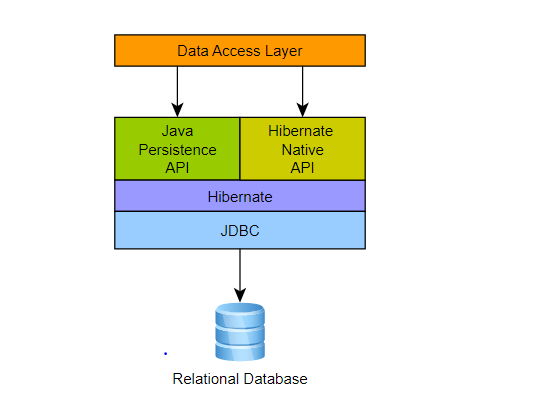
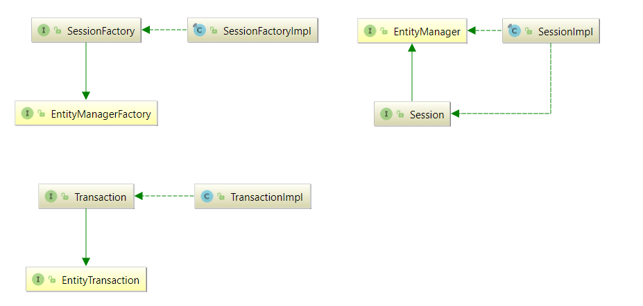
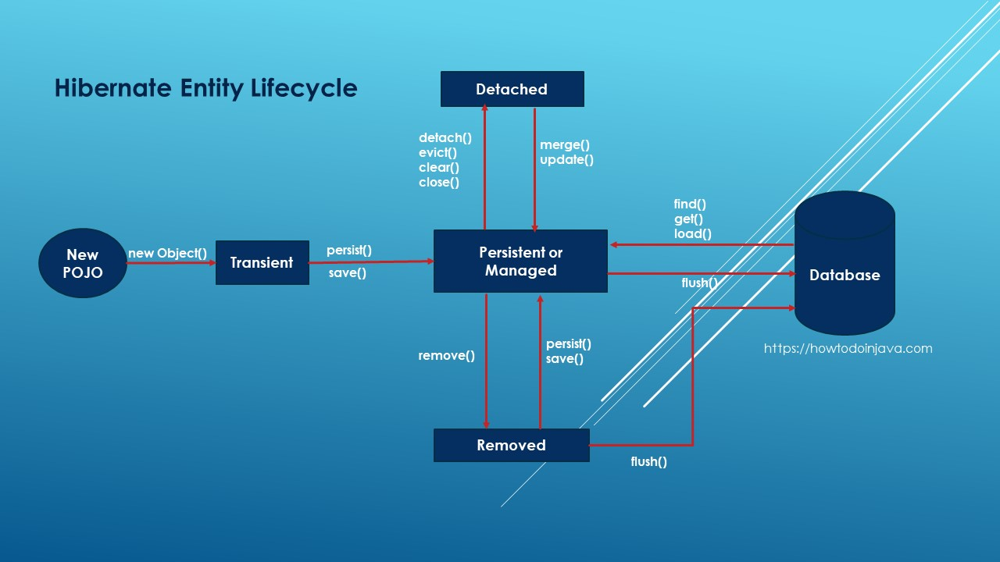
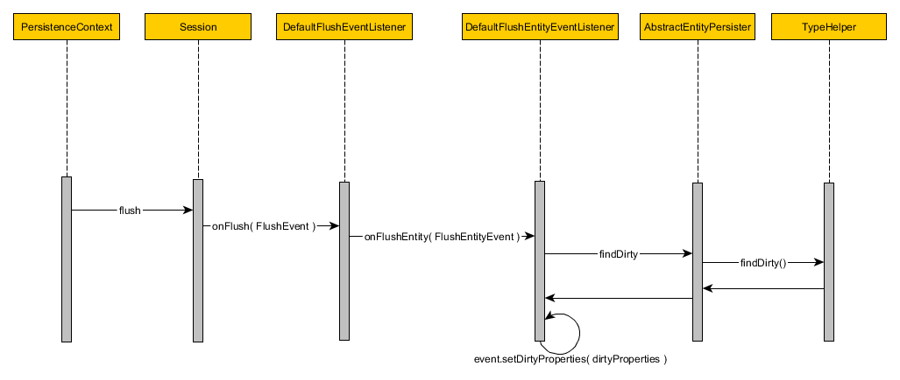
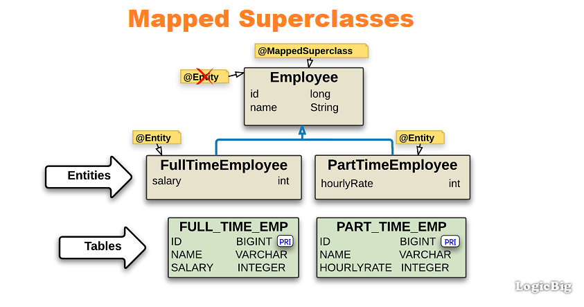
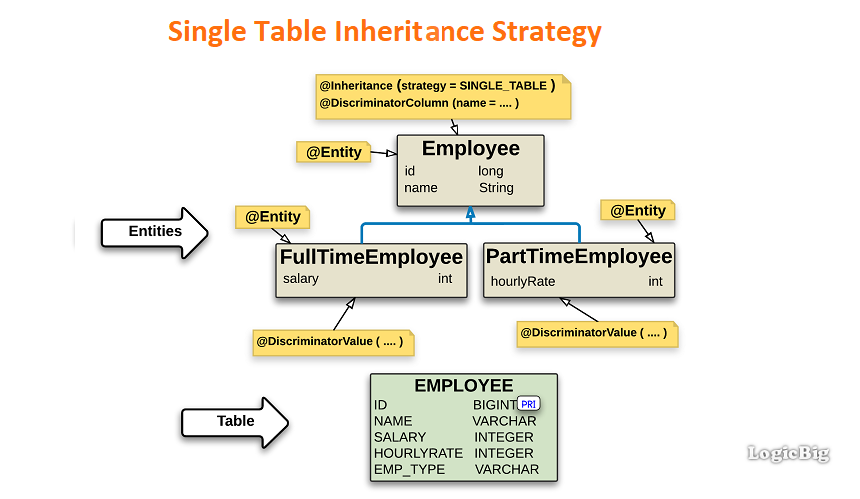
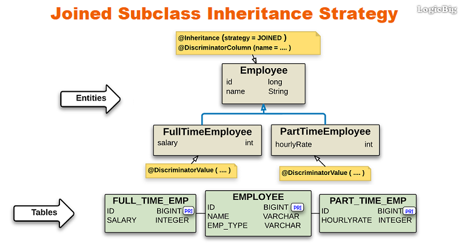
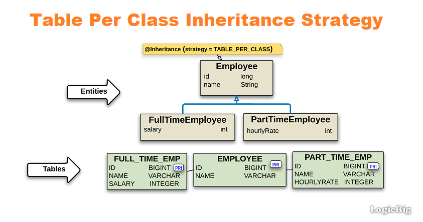

# Hibernate knowledge
## Core
### Architecture

<details>
  <summary>Overview</summary>
  <br/>
  
  
  
</details>

<details>
  <summary>JPA vs ORM</summary>
  <br/>
  
  **ORM:** Object Relational Mapping is concept/process of converting the data from Object oriented language to relational DB and vice versa.
  
  **JPA:** The Java Persistence API is a Java specification. JPA is now considered the standard approach for Object to Relational Mapping (ORM).
  
</details>

<details>
  <summary>JPA and Hibernate</summary>
  <br/>
  
  
  
  JPA architecture | Hibernate architecture | 
  --- | --- |
  EntityManagerFactory | SessionFactory |
  EntityTransaction | Transaction |
  EntityManager | Session |

</details>

### Pros & cons (vs JBDC)


### Persistence Context

A persistence context is a set of entity instances. Within the persistence context, the entity instances and their lifecycle are managed.

<details>
  <summary>Persistence Context Type</summary>
  <br/>
    
  Persistence contexts are available in two types:

  + Transaction-scoped persistence context (default)
  + Extended-scoped persistence context

</details>

<details>
  <summary>Persistent Context and Session</summary>
  <br/>
  
  + **Persistent Context** is a run time memory area where Hibernate holds the references of objects (entities). At runtime whenever a session is opened and closed, between those open and close boundaries Hibernate maintains the object in a **Persistence Context**.
  + **Session** provides API to interact with the **enities**. Some APIs are provided by **Session**: _(session -> entities)_
    + Basic CRUD operation
    + Query Execution
    + Control of Transaction
    + Management of Persistent Context
  
  Ref: https://tech.lalitbhatt.net/2014/07/hibernate-persistent-context-and-session.html
  
</details>

### Entity lifecycle

<details>
  <summary>Overview</summary>
  <br/>
  
  
  
  State | Description | 
  --- | --- |
  New or Transient | Transient entities exist in heap memory as normal Java objects. The persistent context does not track the changes done on them. It don't associcate with any **Session** and not mapped to any database table row.|
  Persistent or Managed | A persistent entity is mapped to a specific database row. Hibernate’s current running **Session** is responsible for tracking all changes. |
  Detached | Detached entities have a representation in the database but these are currently not associcate with any **Session**. |
  Removed | Removed entities are entities that already exist in the database and will be deleted after flushing (commit) |
  
  Ref: https://howtodoinjava.com/hibernate/hibernate-entity-persistence-lifecycle-states/
  Ref: 
  
</details>

### Automatic dirty checking
<details>
  <summary>Explain</summary>
  <br/>
  
  For managed entities, Hibernate can auto-detect incoming changes and schedule SQL UPDATES. This mechanism is called automatic dirty checking.
  
  
  _At flush time (commit)_
  
  Ref: https://www.codementor.io/@narendrasharma95ns/life-cycle-of-an-entity-object-dirty-checking-in-hibernate-lvh1dh5jz
  
</details>

### Inheritance

Inheritance is one of the most important of object-oriented principles. But the relational databases do not support inheritance. Hibernate’s Inheritance Mapping strategies deal with this issue.

<details>
  <summary>Types of inheritance strategy</summary>
  <br/>
  
  + MappedSuperclass – the parent classes, can't be entities
  + Single Table – The entities from different classes are placed in a single table.
  + Joined Table – Each class has its table, and querying a subclass entity requires joining the tables.
  + Table per Class – All the properties of a class are in its table, so no join is required.
  
  Ref: https://www.baeldung.com/hibernate-inheritance
  
</details>
<details>
  <summary>MappedSuperclass</summary>
  <br/>
  
  
  
</details>
<details>
  <summary>Single Table</summary>
  <br/>
  
  
  
</details>
<details>
  <summary>Joined Table</summary>
  <br/>
  
  
  
</details>
<details>
  <summary>Table per Class</summary>
  <br/>
  
  
  
</details>

### Identifiers

<details>
  <summary>Identify type</summary>
  <br/>
  
  + **Auto:** Let Hibernate pick one of the following strategies.
  + **Identity:** Use an autoincremented database columns.
  + **Sequence:** Use a database sequence.
  + **Table:** Use a database table to simulate a sequence (The table will be stored ids).
  
  Ref: https://thorben-janssen.com/primary-key-mappings-jpa-hibernate/
</details>
<details>
  <summary>Identity vs Sequence</summary>
  <br/>
  
</details>
<details>
  <summary>Graps of the Primary key when rollback the transactions</summary>
  <br/>
  
  
  + Ref: https://stackoverflow.com/questions/449346/mysql-auto-increment-does-not-rollback
  + Ref: https://stackoverflow.com/questions/22787153/gaps-in-the-sequence-values-generated-by-jpa-generatedvalue-with-postgresql
  + Ref: https://stackoverflow.com/questions/20636144/are-jpa-and-hibernate-entity-identifiers-reset-to-null-after-a-rollback/67401366#67401366
</details>
<details>
  <summary>Why does Hibernate disable INSERT batching when using an IDENTITY?</summary>
  <br/>
  
  + Ref: https://stackoverflow.com/questions/27697810/why-does-hibernate-disable-insert-batching-when-using-an-identity-identifier-gen
</details>

### Map Associations

<details>
  <summary>Types of associations</summary>
  <br/>
  
  + OneToOne
  + OneToMany
  + ManyToOne
  + ManyToMany
  
  
  
</details>
<details>
  <summary>OneToOne</summary>
  <br/>
  
  PK and FK columns are most often indexed, so sharing the PK can reduce the index footprint by half, which is desirable since you want to store all your indexes into memory to speed up index scanning. And EAGER fetching is bad.
  
  The best way to map a `@OneToOne` relationship is to use `@MapsId`. (use the `@JoinColumn` to customize the key name)
  
  While the unidirectional `@OneToOne` association can be fetched lazily, the parent-side of a bidirectional `@OneToOne` association is not.
  
  ```
  @Entity(name = "management")
  public class ManagementEntity implements Serializable {

      private static final long serialVersionUID = -495703064152328044L;

      @OneToOne(fetch = FetchType.LAZY, orphanRemoval = true)
      @JoinColumn(name = "data_id")
      @MapsId
      private DataEntity dataEntity;

      @Id
      @Column(name = "management_id")
      private Long managementId; // You’ll notice that the @Id column no longer uses a @GeneratedValue annotation since the identifier is populated with the identifier of the DataEntity association.
      
      ...
  }
  ```
  
  Ref: https://vladmihalcea.com/the-best-way-to-map-a-onetoone-relationship-with-jpa-and-hibernate/
</details>
<details>
  <summary>OneToMany & ManyToOne</summary>
  <br/>
  
  `@ManyToOne` might be just enough. It does not mean this should be the default option for every one-to-many database relationship.
  
  In reality, `@OneToMany` is practical only when many means few.
  
  Note: If not careful, `@ManyToOne` can cause _n+1 select issue_
  
  + Ref: https://vladmihalcea.com/the-best-way-to-map-a-onetomany-association-with-jpa-and-hibernate/  
  + Ref: https://thorben-janssen.com/best-practices-many-one-one-many-associations-mappings/#Avoid_the_mapping_of_huge_to-many_associations
</details>
<details>
  <summary>ManyToMany</summary>
  <br/>
  
  You should never use a `List` if you model a `Many-to-Many` association. Instead of a `List`, we can use a `Set`.
  
  Avoid the CascadeTypes REMOVE and ALL, which includes REMOVE
  
  ```
  @Entity(name = "post")
  public class Post {
  
      @ManyToMany(cascade = {
          CascadeType.PERSIST,
          CascadeType.MERGE
      })
      @JoinTable(name = "post_tag",
          joinColumns = @JoinColumn(name = "post_id"),
          inverseJoinColumns = @JoinColumn(name = "tag_id")
      )
      private Set<Tag> tags = new TreeSet<>();
      ...
  }
  ```
  
  ```
  @Entity(name = "tag")
  public class Tag {

      @ManyToMany(mappedBy = "tags")
      private Set<Post> posts = new TreeSet<>();
      ...
  }
  ```
  
  + Ref: https://vladmihalcea.com/the-best-way-to-use-the-manytomany-annotation-with-jpa-and-hibernate/
  + Ref: https://thorben-janssen.com/best-practices-for-many-to-many-associations-with-hibernate-and-jpa/
</details>

### Cascade
<details>
  <summary>Cascading best practices</summary>
  <br/>

  + Cascading only makes sense only for Parent – Child associations (the Parent entity state transition being cascaded to its Child entities). 
  + Cascading from Child to Parent is not very useful and usually, it’s a mapping code smell.

  Ref: https://vladmihalcea.com/a-beginners-guide-to-jpa-and-hibernate-cascade-types/

</details>
<details>
<summary>One-To-One</summary>
<br/>

</details>

### Query
<details>
  <summary>JPQL</summary>
  <br/>
  The JPQL (Java Persistence Query Language) is a query language which is used to perform database operations on persistent entities. The role of **JPA** is to transform JPQL into SQL.
  
  
</details>
  
### Optimistic vs. Pessimistic Locking
<details>
  <summary>Optimistic locking</summary>
  <br/>
  
  + Ref: https://vladmihalcea.com/optimistic-vs-pessimistic-locking/
</details>
<details>
  <summary>Pessimistic locking</summary>
  <br/>
  
</details>

### Flush Mode
  
<details>
  <summary>Overview</summary>
  <br/>
  
  Flushing is the process of synchronizing the state of the persistence context with the underlying database.
  
  Mode | Description | Note
  --- | --- | --- | 
  AUTO | It flushes the changed entities before committing a transaction and before executing a query related to an entity that has any pending changes | supported by JPA and Hibernate (DEFAULT) Similar.
  COMMIT | It flushes the changed entities before committing a transaction but doesn't execute any pending changes before a query | supported by JPA and Hibernate.
  ALWAYS | It's similar `AUTO` mode. But it will execute with every query | supported by Hibernate.
  MANUAL | It deactivates all automatic flushes and requires the application to trigger the flushes automatically. | supported by Hibernate (high risks)
  
  _Note:_
  + `flush()` is called only after executing a JPQL query or a Criteria Query.
  + If you use default functions in `JpaRepository`, you must call the `flush()` function manually.
  
  Ref: https://thorben-janssen.com/flushmode-in-jpa-and-hibernate/
</details>
<details>
  <summary>Which mode should be used?</summary>
  <br/>
  
  By default, the **FlushMode** is set to `AUTO`, and I recommend you **DON’T** change it.
  
</details>
<details>
  <summary>flush() vs commit()</summary>
  <br/>
  
  + `flush()` will synchronize your database with the current state of object/objects held in the memory but it does not commit the transaction.
  + `commit()` will make data stored in the database permanent.
  
  Ref: https://stackoverflow.com/questions/14581865/hibernate-flush-and-commit
</details>  
  
### DTO
<details>
  <summary>How to use DTO?</summary>
  <br/>

  Ref: https://thorben-janssen.com/dto-projections/
  
</details>

### Logging
<details>
  <summary>Hibernate logging</summary>
  <br/>
  
  Ref: https://vladmihalcea.com/the-best-way-to-log-jdbc-statements/
  
</details>

### Performance review

<details>
  <summary>Overview</summary>
  <br/>
  
  + Ref: https://vladmihalcea.com/hibernate-performance-tuning-tips/
  + Ref: https://thorben-janssen.com/tips-to-boost-your-hibernate-performance/
  
</details>
<details>
  <summary>DTO projections</summary>
  <br/>
  
  Ref: https://thorben-janssen.com/entities-dtos-use-projection/
</details>
<details>
  <summary>Insert/Update Batch</summary>
  <br/>
  
  ```
  spring:
    jpa:
      properties:
        hibernate: 
          jdbc.batch_size: 5 # Hibernate will silently disable batch inserts if we use GenerationType.IDENTITY
          order_inserts: true
          order_updates: true
          batch_versioned_data: true
  ```
  + Ref: https://stackoverflow.com/questions/50772230/how-to-do-bulk-multi-row-inserts-with-jparepository
  + Ref: https://www.baeldung.com/jpa-hibernate-batch-insert-update
</details>
 
## Common pitfalls
### Avoid CascadeType.REMOVE for to-many associations
<details>
  <summary>Root cause</summary>
  <br/>
  
  
  
</details>
<details>
  <summary>Solution</summary>
  <br/>
  
  Ref: https://thorben-janssen.com/avoid-cascadetype-delete-many-assocations/
</details>
  
### LazyInitializationException

<details>
  <summary>Root cause</summary>
  <br/>
  
  Hibernate throws the LazyInitializationException when it needs to initialize a lazily fetched association to another entity without an active session context.
  
  ```
  EntityManager em = emf.createEntityManager();
  em.getTransaction().begin(); // open session

  TypedQuery<Author> q = em.createQuery(
          "SELECT a FROM Author a",
          Author.class);
  List<Author> authors = q.getResultList();
  em.getTransaction().commit();
  em.close(); //session is closed

  for (Author author : authors) {
      List<Book> books = author.getBooks();
      log.info("... the next line will throw LazyInitializationException ...");
      books.size();
  }
  ```

  Ref: https://thorben-janssen.com/lazyinitializationexception/#:~:text=Hibernate%20throws%20the%20LazyInitializationException%20when,client%20application%20or%20web%20layer.
  
</details>
<details>
  <summary>Solution</summary>
  <br/>
  
  1. Make sure to load all associated entities in before closing the session (LEFT JOIN FETCH clause, `@NamedEntityGraph` or the _EntityGraph_ API.)
  2. Use a DTO projection instead of entities. DTOs don’t support lazy loading
  
</details>

### N+1 query problem
<details>
  <summary>Root cause</summary>
  <br/>
  
  The N+1 query problem happens when the data access framework executed N additional SQL statements to fetch the same data that could have been retrieved when executing the primary SQL query.
  
  _For example:_
  We have a relationship `one-to-many` company -> employees. 
  
  If we select all employees in the database.
  ```
  List<Employee> comments = entityManager.createNativeQuery("""
      SELECT * 
      FROM employee
      """, Employee.class)
  .getResultList(); 
  ```
  And, laster, we decide to fetch associated `company` for each employee.
  
  ```
  for (Employee employee : employees) {
      Long employeeId = ((Number) comment.get("employeeId")).longValue();

      Company company = (String) entityManager.createNativeQuery("""
          SELECT *
          FROM company c
          WHERE c.id = :employeeId
          """, Company.class)
      .setParameter("employeeId", employeeId)
      .getSingleResult();
  }
  ```
  _Query_
  
  ```
  SELECT *
  FROM employee

  // trigger the N+1 query issue
  SELECT * FROM company c WHERE c.id = 1
  SELECT * FROM company c WHERE c.id = 2
  SELECT * FROM company c WHERE c.id = 3
  SELECT * FROM company c WHERE c.id = 4
  ```
  Ref: https://vladmihalcea.com/n-plus-1-query-problem/
</details>
<details>
  <summary>Solution</summary>
  <br/>
  All we need to do is extract all the data you need in the original SQL query
  
  ```
  List<Employee> employees = entityManager.createNativeQuery("""
      SELECT *
      FROM employee emp
      JOIN company c ON emp.company_id = c.id
      """, Employee.class)
  .getResultList();

  for (Employee employee : employees) {
      LOGGER.info("{}", employee);
  }
  ```
</details>  

